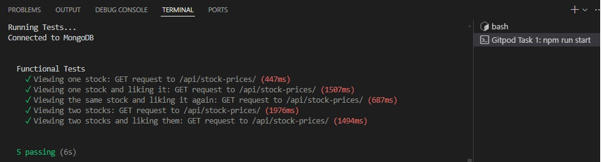
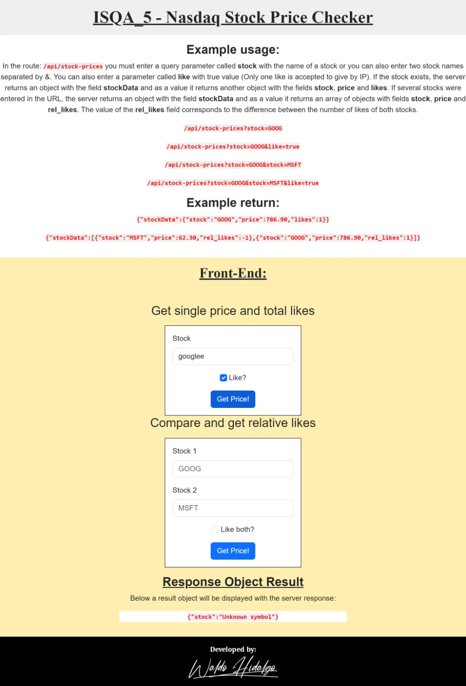
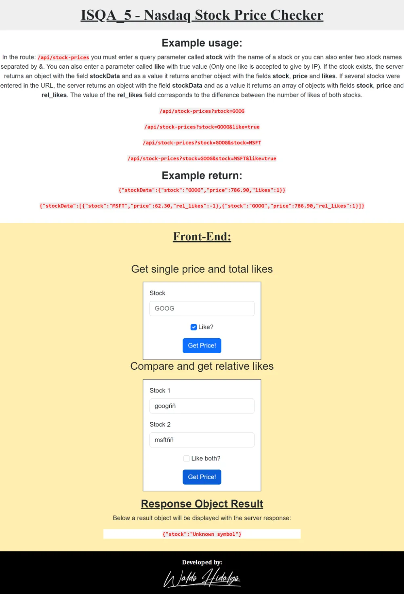

# Stock Price Checker

Solución al [primer proyecto](https://freecodecamp.org/learn/information-security/information-security-projects/stock-price-checker) requisito obligatorio para obtener la **Information Security Certification** de freecodecamp.

El proyecto consiste en crear un servidor el cual disponibiliza una ruta que recibe como query parameter **stock** igual al nombre de alguna acción. Los datos de la acción son consultados en la siguiente URL:

> [https://stock-price-checker-proxy.freecodecamp.rocks](https://stock-price-checker-proxy.freecodecamp.rocks)

Si la acción existe, el servidor retorna un objeto con la propiedad **stockData** y el valor igual a un objeto con las siguientes propiedades: **stock**, **price** y **likes**. También se puede añadir un query parameter **like** con el valor de true, el cual aumenta en uno el like a dicha stock. Solo se permite dar un like por IP. Por último, también se pueden pasar más de una stock a la ruta y también el query parameter **like** y en ese caso se dará like a ambas stocks si la IP ya no ha dado like antes. Cuando se presenta un error ya sea, por ejemplo, que una stock no exista, el servidor responde con el objeto siguiente:

> { stock: "Unknown symbol" }

El registro de IPs se realiza en una collection de una base de datos MongoDB encriptando dichas IP utilizando la librería **bcrypt**.

## Tabla de Contenidos

- [Stock Price Checker](#stock-price-checker)
  - [Tabla de Contenidos](#tabla-de-contenidos)
  - [Requisitos](#requisitos)
  - [Proyecto Aprobado](#proyecto-aprobado)
  - [Test Superados](#test-superados)
  - [Screenshots](#screenshots)
    - [1. Home](#1-home)
    - [2.Consulta de Solo una Stock Válida](#2consulta-de-solo-una-stock-válida)
    - [3.Consulta de una Stock con Like](#3consulta-de-una-stock-con-like)
    - [4. Consulta de Stock Inválida](#4-consulta-de-stock-inválida)
    - [5.Consulta de Dos Stocks Válidas](#5consulta-de-dos-stocks-válidas)
    - [6. Consulta de Dos Stocks con solo una válida](#6-consulta-de-dos-stocks-con-solo-una-válida)
    - [7.Consulta de Dos Stocks Inválidas](#7consulta-de-dos-stocks-inválidas)
  - [Test Funcionales Creados](#test-funcionales-creados)
    - [1.Viewing one stock: GET request to /api/stock-prices/](#1viewing-one-stock-get-request-to-apistock-prices)
    - [2.Viewing one stock and liking it: GET request to /api/stock-prices/](#2viewing-one-stock-and-liking-it-get-request-to-apistock-prices)
    - [3.Viewing the same stock and liking it again: GET request to /api/stock-prices/](#3viewing-the-same-stock-and-liking-it-again-get-request-to-apistock-prices)
    - [4.Viewing two stocks: GET request to /api/stock-prices/](#4viewing-two-stocks-get-request-to-apistock-prices)
    - [5.Viewing two stocks and liking them: GET request to /api/stock-prices/](#5viewing-two-stocks-and-liking-them-get-request-to-apistock-prices)

## Requisitos


## Proyecto Aprobado


## Test Superados



## Screenshots

### 1. Home


### 2.Consulta de Solo una Stock Válida


### 3.Consulta de una Stock con Like


### 4. Consulta de Stock Inválida



### 5.Consulta de Dos Stocks Válidas


### 6. Consulta de Dos Stocks con solo una válida


### 7.Consulta de Dos Stocks Inválidas



## Test Funcionales Creados

### 1.Viewing one stock: GET request to /api/stock-prices/

```js
test("Viewing one stock: GET request to /api/stock-prices/", function (done) {
  chai
    .request(server)
    .keepOpen()
    .get("/api/stock-prices?stock=GOOG")
    .end(function (err, res) {
      assert.equal(res.status, 200);
      assert.isString(res.body.stockData.stock);
      assert.isNumber(res.body.stockData.price);
      assert.isNumber(res.body.stockData.likes);

      done();
    });
});
```

### 2.Viewing one stock and liking it: GET request to /api/stock-prices/

```js
test("Viewing one stock and liking it: GET request to /api/stock-prices/", function (done) {
  chai
    .request(server)
    .keepOpen()
    .get("/api/stock-prices?stock=GOOG&like=true")
    .end(function (err, res) {
      assert.equal(res.status, 200);
      assert.isString(res.body.stockData.stock);
      assert.isNumber(res.body.stockData.price);
      assert.isNumber(res.body.stockData.likes);

      assert.equal(1, res.body.stockData.likes);

      done();
    });
});
```

### 3.Viewing the same stock and liking it again: GET request to /api/stock-prices/

```js
test("Viewing the same stock and liking it again: GET request to /api/stock-prices/", function (done) {
  chai
    .request(server)
    .keepOpen()
    .get("/api/stock-prices?stock=GOOG&like=true")
    .end(function (err, res) {
      assert.equal(res.status, 200);
      assert.isString(res.body.stockData.stock);
      assert.isNumber(res.body.stockData.price);
      assert.isNumber(res.body.stockData.likes);
      // likes should be the same
      assert.equal(1, res.body.stockData.likes);
      done();
    });
});
```

### 4.Viewing two stocks: GET request to /api/stock-prices/

```js
test("Viewing two stocks: GET request to /api/stock-prices/", function (done) {
  chai
    .request(server)
    .keepOpen()
    .get("/api/stock-prices?stock=AAPL&stock=MSFT")
    .end(function (err, res) {
      assert.equal(res.status, 200);
      assert.isObject(res.body.stockData[0]);
      assert.isObject(res.body.stockData[1]);

      assert.property(res.body.stockData[0], "rel_likes");
      assert.property(res.body.stockData[1], "rel_likes");
      assert.equal(
        res.body.stockData[0]["rel_likes"] + res.body.stockData[1]["rel_likes"],
        0
      );

      done();
    });
});
```

### 5.Viewing two stocks and liking them: GET request to /api/stock-prices/

```js
test("Viewing two stocks and liking them: GET request to /api/stock-prices/", function (done) {
  chai
    .request(server)
    .keepOpen()
    .get("/api/stock-prices?stock=AAPL&stock=MSFT&like=true")
    .end(function (err, res) {
      assert.equal(res.status, 200);
      const stockData1 = res.body.stockData[0];
      const stockData2 = res.body.stockData[1];
      assert.isObject(stockData1);
      assert.isObject(stockData2);

      assert.property(stockData1, "rel_likes");
      assert.property(stockData2, "rel_likes");
      assert.equal(stockData1["rel_likes"] + stockData2["rel_likes"], 0);

      done();
    });
});
```
